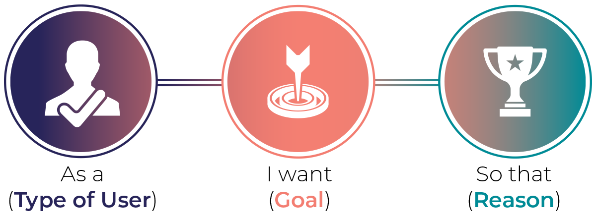
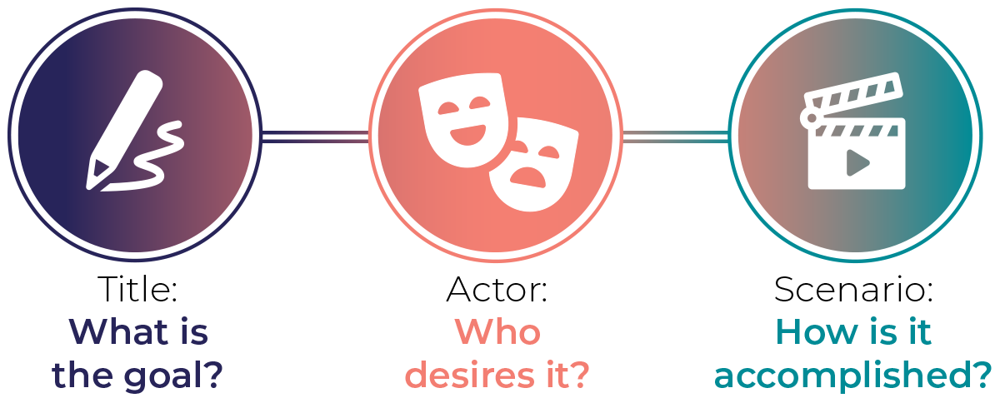
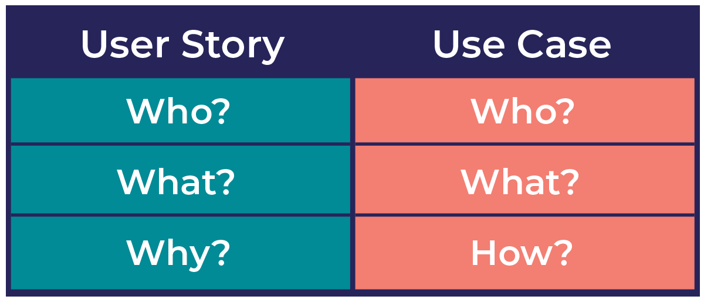
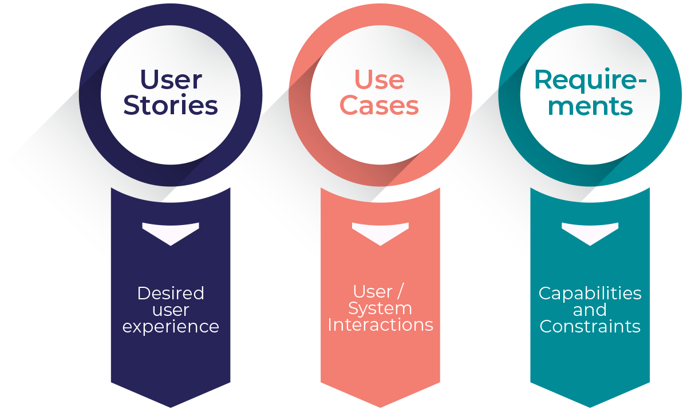
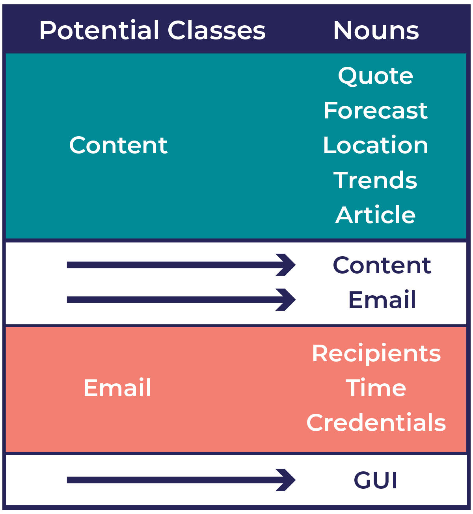
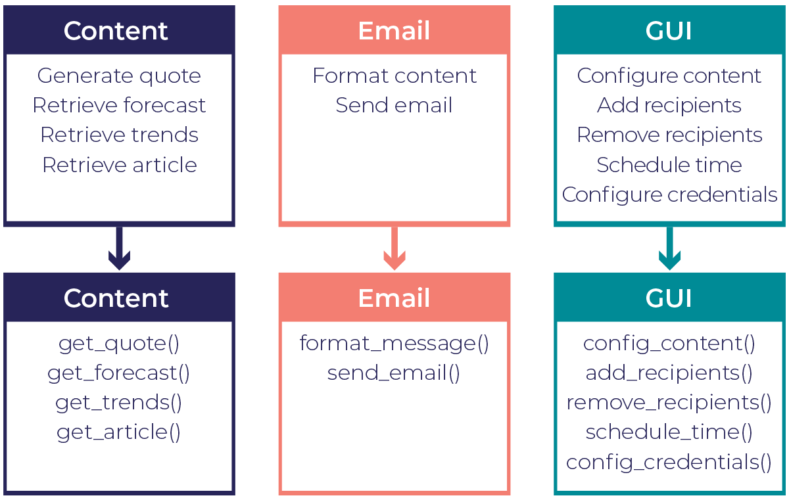

# Python Week 1-4

# WEEK-1
# DAY 1 - 3

Indentation is very important in python compared to java that I'm more familiar of. Statements that go together must have the same indentation. Wrong indentation causes errors.
PyCharm and VScode automate indentation, making it easier and offer more support for python 

Portable
Python code is portable due to it being interpreted rather than compiled, which would require the code to be first converted to binary code(0s and 1s) using a complier. When you run the program the linker would first have to  copy the code from disk to memory. 
Python does not need the code to be compiled to binary, it converts to the code into bytecode and translated it into the native language of the computer. 
Supports procedure-oriented programming - program is built around procedures or functions (reusable pieces of programs).
Supports OOP - programs built around objects which combine data and functionality. 
Strings are immutable in Python?
String formatting in Python is cleaner.
Concatenation is not neat and is error-prone.
String conversion is done automatically by the format method, i.e. Create variable and assign it a value which you then call with its index. Assign those variables as arguments the format method. Can also use named parameters using f-strings, all you do is place letter f before the string Ex: (f'{name} was {age} years old')
Does literal constants mean I cannot write numbers purely as a String? *Interesting*
Boolean NOT negates True to False and False to True.
Boolean AND (x and y) returns False if x is False, else it returns y. 
Boolean OR, if x is True returns True, else returns evaluation of 
Floor division //

# DAY 4
SETS: are usefull for removing duplicates from a list because they can only contain unique values and their order is randomized. Their elements cannot be accessed with index or slicing syntax. 
Explored sets union and how duplicates can be removed using examples from https://realpython.com/python-sets/

TUPLES: are also similar to List but declared with parenthesis() instead of square brackets[], but can also be without parenthesis. They cannot be modified, elements can be accessed via index. Take up less memory, usefull    for storing large amounts of data compared to lists. Also useful for returning multiple values from a a function.

DICTIONARIES: work with Key-Value pairs. import defaultdict from collections package, it easier to work with. defaultdict creates a new default value if a key doesn't exist yet, instead returning an error. You must specify   the type of object you want returned.

LIST COMPREHENSIONS: enclosed in square brackets. Enables you to filter or apply functions to every item in the list. They are useful for cleaning string and handling large datasets

LIST COMPREHENSIONS with FUNCTIONS
SPLIT Function: Allows you to split a string based on a given character or string, using a period as a delimiter or spaces if there is no delimiter available. The string is then separated from the period. 
To remove periods and apply lowercase we can create a function which uses "replace" and "lower" functions to remove periods and convert string to lowercase

DICTIONARIES & COMPREHENSIONS
Can create new dictionary from an iterable structure using comprehensions.

# DAY 5
If Else: Python uses "elif" for "else if". If statements can be concluded without an else statement, the next code can execute when the If code is not executed
While loops: Code can run forever if not provided a break statement to exit from the loop and move to the next line of code. Continue statement is useful for skipping over lines that come after the continue statement. Continue can be used inside if statement to stop some code in the loop from running. Continue and break can also be used for rearanging code and making it neat.
For Loop: You can declare a variable that will hold the value of each element as you go through the list. 
Pass: Used as a stub

# WEEK-2
# DAY 1

FUNCTIONS
Consists of name and parameters(created with "def" keyword). after "def comes an identifier name followed by a pair of parentheses whic may enclose variable names. A function is a reusable piece of a program, allowing you to run the specific block of code using the specified name by "calling the function".

NAMED PARAMETERS: (OR Keyword arguments) Used to assign a default value to the operation parameter.
Parameters and Arguments mean the same thing, information that is passed into a function. 
Function must be called with correct number of args, not more, not less.

*args: Use a * before parameter name if you do not know how many args to pass on to a function, but this only works for positional arguments, not keyword arguments.
**kwargs: Is a method used to handle keyword arguments. Keyword args get stored as a dictionary instead of tuple because they have keys and values can be passed in any order. 

VARIABLES & SCOPE

Locals(): Variables that are only accessible locally within a function. Trying to access a variable outside its scope results in an error.

Globals(): Defined outside the function, in the main code block. Allows for access of many items including Python pre-built variables
Python checks the local scope first for a variable, before moving to check the global scope. We can also redefine a variable that is local and global so it we can print both the local and global data.
We can also declare a function within another function, the inner function can only be called within the function it is declared in. Calling it outside will result in an error
A function is represented as an object.
Think of Functions as some variables that are associated with some data
Create Python Text Processing Functions to clean text.(Important in businesses, for processing text)

Lambda Functions: Used to represent a function without giving it a variable name(lambda x: x + 3)(5), the return key is implied. Handy for passing a function as an argument to another Python function.
An underscore is used as a variable name to indicate that the variable is not used.

# DAY 2
ANATOMY OF A CLASS

Static Attributes: Defining a static variable outside a constructor means each instance will share the same values.
Static variables: don't change with each instance and are commonly used to hold constants or important business logic. 
They can still be changed, so to prevent this, programmers add an underscore before the variable name(indicating the variable should not be modified directly, a getter method should be used instead).
A getter method: retrieves the value of the variable, without passing in the self attribute because the variable is static.
A static method: does not belong to any particular class instance, whereas an Instance method belongs to a particular instance.
Decorator: is special annotation or description of a function definition used to explicitly state the function as static method and should not have "self" passed in as an argument. Allowing use of a function without creating an instance of the class. 

INHERITANCE

Class Inheritance: A parent(original) class passes on its attributes and methods to a child class. The child extends the parent. 
This inheritance occurs automatically when the child gets created. If the child defines an attribute or method that is the same as the parent, the child's version will overwrite the parent's version.
Extending Built-in classes: Can create a new list by instantiating it as a "list". Although it appears as a function, a list is a class. 
To avoid infinite recursion/endless loop, we do not use "self.append". We call the original append function in the parent class by using super function (super.append) to access the underlying instance of the parent class. To avoid overwriting the constructor of the parent class, we use super in the function when adding a new attribute to child class.

# DAY 3
ERROR HANDLING

HANDLING ERRORS/EXCEPTIONS

Exceptions: in Python are determined during runtime and can be retried, whereas errors cannot be retried. But there are exceptions to this rule. Errors abd Exceptions are actually the same thing. All Python errors and exceptions stem from a class called the base exception. It provides useful properties to exceptions, such as halting code and proving information about why and how it was executed.
Traceback: is a Stack trace, provides a trail through the stack to assist in debugging. Important to know how to interpret the stack trace.
Try/Except: Statement is used to catch an exception and obtain an instance of the raised exception. We can choose to print something out(a message) as a way of handling the error.
Finally: If you take the Try / Except block and add a "finally" to it, this will always execute and gets printed out. "Finally" statements will always execute no matter what happens inside the try block. The error is thrown but still printed out. Often used to time how long a function takes to execute. We can import the time class to time our function.
Type error: Happens when we try to add data types that do not match(ex. string + int). 
Most specific exceptions should be at the top and general ones to follow, so they can be handled by order of importance. Custom decorators can also be used to do the same
Custom Exceptions can be created with customized functions

# DAY 4
THREADS AND PROCESSES

Variables Are stored in short-term memory of computer(Processor)
First program saves files to disk, second program running in its own process picks it up and can access the file storage as well. BUt cannot access it if written to memory as the processes are seperated by the OS, allocating memory for each process.
OS allows us to move the two pieces of code into the same process, and they get to share memory. They run parallel and the same time on separate threads, instead of the same process.
A process can have multiple threads and execute code at the same time in parallel. Inside a single process we compute each statement sequentially, instead of parallel.
Install multiprocess 3rd party module to be able to define and run functions in the same Jupyter Notebook. Multiprocess has all the same functions and is used the same as multiprocessing, but it does not have the bug with pickiness about where the function is defined.
Processes do not share memory. They get a copy of this dictionary in their own separate memory space, and we have no way of accessing it except if they record it somewhere like a file system or a database. One thing we can do is print the computed value from within the function itself
Multi-threading decrease the run-time, making it faster when the program has periods of "waiting" and doing nothing.

# DAY 5
WORKING WITH FILES

Use open() to open the to work with first
Use .readline() to read a line from the text file
Use .readlines() to read all lines
Use .write() to write/append to file
Use .close to close the opened file

CSV file: Convert from reader object to a list object for use-able data.
Open CSV file with CSV reader class
Can filter CSV data after converting with ranges
Can write to CSV file using writer class

JSON: formatted string looks like Python dictionary, but it's a string. to turn it into a dictionary, we need to import the JSON module at the top of our notebook, import json, and then use a method called json.loads and pass in the string. Notice that this is called loads plural and not load singular
Dumping JSON: For this, use the json.dumps method. Here is pythonDict, you are going to use json.dumps pythonDict. Notice that this is dumps plura

# WEEK 3
# DAY 1
PROJECT PLANNING

Find and nurture project ideas(Inspiration)
Come up with 3 project ideas
**User stories**: depict small scenarios from user's perspective. They emphasize their goal and motivation. 
User stories are brief, simple and informal. Format: "As a [user/role], I want [goa] so that [reason/benefit]" 
Ex. "As a digest recipient, I want to receive an email every morning with current and useful information so that I know what is going on in the world and learn something new each day."

**Use cases**: Include a title, actor(user/system), and a scenario that describes how a goal is achieved. Scenario can be a paragraph or list of steps in simple language.

**User Story VS Use Case**

**Project Requirements**
It is important tp write down traditional requirements to formally capture the capabilities and limitations of an application.
**Functional requirements** describe what the application should or should not do, written in sentences starting with the "the application must" or "the application shall."
For example, the daily digest application must generate a random inspirational quote and retrieve current weather forecasts, Twitter trends, and a random Wikipedia article. 
It should format this content into an email and send it to a specified recipient list. These requirements act as a checklist to ensure the application meets all necessary functionalities.

These requirements are kept at a high level, without specific details. Additional functional requirements related to the admin include configuring content sources, adding and removing recipients,
scheduling the email digest, and setting email account credentials.

**Non-functional requirements**: describe how the application should accomplish its tasks. They focus on qualities like maintainability, reliability, and usability. 
For example, the application should have a configurable GUI for the admin to interact with, be extensible for adding more content types, and be resilient to content errors.

**Architecture**: Organize and structure the code application. Identifying nouns helps determine potential objects.
For instance, in the functional requirements, words like quote, forecast, location, trends, article, content, email, and recipients stand out as potential objects.

Grouping related nouns together, such as content and email, provides a starting point for potential classes. 
Content, email, and GUI emerge as candidates for classes. Next, the behaviors and responsibilities are determined by extracting simplified verb phrases from the requirements, like generating quotes, retrieving forecasts, formatting content, and sending emails. 
These behaviors are assigned to the corresponding classes based on their relevance.

The content class is responsible for generating and retrieving content, the email class handles formatting content and sending emails, and the GUI class manages configuration-related behaviors. 
This process helps draft method names and provides an initial structure for the program.

While a comprehensive plan is necessary for team projects, for solo developers and smaller projects, focusing on a rough plan with three classes is sufficient to begin coding. 
The plan may evolve as implementation progresses, and changes are expected.

**Stub code**: Useful for providing structure for implementation, allowing separate development of parts of an application.

# DAY 2
CONTENT RETRIEVAL

get_random_quote function to generate random quotes from csv file
The CSV format is chosen for simplicity, with each line containing the author and quote separated by a vertical pipe symbol.
The CSV file is opened, and a list of dictionaries is created using list comprehension, where each dictionary represents an author and their quote. The CSV reader is instructed to use the vertical pipe symbol as the delimiter. In the except block, a default quote is defined in case the file fails to load.

Openweather API 
When accessing the forecast API, the default format for the returned data is JSON. An example of this JSON response can be found in the documentation. However, since the JSON contains more weather information than necessary for the email, only use a select few fields that are relevant. Now, let's examine the Python code that calls and utilizes the forecast API.
The get_weather_forecast function retrieves weather forecasts based on coordinates. If no coordinates are provided, it uses a default location
request module to retrieve the JSON response from the API, which is then parsed into a Python dictionary using the JSON module's load function.

Trending Social Media Content (Twitter) - THIS DID NOT WORK
It is important to use actively maintained libraries when working with APIs since they can change over time. Unfortunately, this library did not have the required functionality, so continue your search.
It is important to highlight that using Google or similar resources to learn how to accomplish something is not considered cheating. It is a misconception some beginner programmers have, but even experienced programmers rely on search engines. In fact, a recent survey showed that nearly 90% of developers turn to Google when they face challenges. The programming field has become so vast that it is impossible for one person to know everything. We should embrace knowledge sharing and collectively enhance our skills.
Tweepy is a popular, regularly updated, Python library and possesses the required capabilities for my project. Its documentation revealed an API method called "trends_place," which retrieves current trends based on a location's unique identifier called WOEID (Where On Earth Identifier).

Importing Articles
fetch a random Wikipedia article. The availability of a Wikipedia API was checked to fulfill this requirement. A search on Google for Wikipedia API documentation led to finding the desired information. Conveniently, Wikipedia offers a REST API that allows access to their content.
o proceed, the get button is clicked, followed by the try it out button. From the dropdown menu, the desired return format can be selected. There are options available to obtain a random page title, the full page HTML, or a summary of key points. Since including an entire Wikipedia article in the digest email is unnecessary, selecting the summary option is ideal. After making the selection, the execute button is clicked.
The updated get Wikipedia article function utilizes the request module's URL open function at line 65 to access the URL for a random page summary. Subsequently, the response is passed to the JSON module's load function for parsing. Only specific information from the response is necessary, namely the page title, summary extract, and URL. These details are extracted and packaged into a dictionary, which is then returned

# DAY 3
WRITING AND FORMATTING EMAIL MESSAGES

Python's MIMEMultipart class allows us to include both formats in a single email message, which will be covered in the next section. It's worth noting that HTML is the more commonly used format for emails these days.
Sometimes, it's better to have both Plaintext and HTML versions in the Daily Digest email. So, to achieve that, the format message method generates both types of content
In the init constructor method, an instance variable is initialized as a dictionary to store the four types of content, each with a Boolean flag indicating if it should be included. The latest content is retrieved using functions from the DD content module.
Moving on to generating HTML content, a similar process is followed. HTML strings are concatenated to the HTML variable (line 51), using HTML tags and angle brackets to define the display format like a webpage.

Sending an email
To send it as an email. Luckily, Python has a convenient library called 'email' in its standard package, which helps manage email messages. This package has various modules, but for this project, focus on the 'email.message' module to handle the email message itself.
The core of this module revolves around a class known as "Email Message." It is the main tool used to put together different components of the daily digest email, like the subject line, recipient list, and, of course, the message content. Moving up a level to the email package, as the documentation explains, this package can assist in handling email messages, but it isn't meant for actually sending them.
In other Python modules like SMTP-Lib, you can find the same functionality. This module lets you create a client session to send emails through an SMTP server. Basically, you need an SMTP email server to connect to. Now, setting up and running your own email server locally is quite a hassle, so I wouldn't recommend it. 

The good news is that many online email services offer an SMTP server that you can use with external email clients and various applications. Around May 2022, Google changed its security policy, and you can no longer sign in programmatically with just a username and password. It is considered less secure. Consequently, Gmail does not work for this solution anymore. Instead, you should use an Outlook email address.
According to Microsoft's support page, there's this handy documentation that gives you the server name, port, and encryption method for connecting to the Outlook SMTP server.
SMTP-Lib, which helps us connect to the outlook server, and the email message class from the email.message module. Moving on, the send email function begins by creating a new email message object. Finally, the send email method establishes a secure connection to the SMTP server using TLS encryption. After logging in with the sender's credentials, we call the send message method to send the email message object.
By including both plain text and HTML versions, the daily digest email becomes compatible with a wider range of email clients and settings.

Task Scheduling
That leaves us with one final task: implementing the ability to send the daily digest at a specific time every day.

To tackle this, include a method called schedule time in the GUI. The idea is for the administrator to use the GUI to set the desired sending time for the email. This time is then passed to the email object, which takes responsibility for sending the email at the scheduled time. 
In order to schedule the daily email sending in the application, opt for a handy library called "schedule" that you can come across on the Python package index. This was chosen because it offers a really easy-to-use interface for scheduling tasks to repeat at specific intervals or times of day, which sounded ideal for what we wanted. However, as you delved into the documentation, you will discover a limitation with this schedule library that you will have to find a solution for.
By default, the scheduler lacks the capability to operate in the background. This means that if a task is scheduled to send an email in the future, the program will remain idle until that task is completed. Consequently, the main thread would become unresponsive, preventing the administrator from interacting with the program
A workaround for running the scheduler as a separate thread can be found in the documentation. There is an example of defining a class called "schedule thread" that inherits Python's thread class to handle the scheduling activity separately from the main thread

# DAY 4
GUI Design Planning

Normally, leave GUI development until the end of a project. This way, you can ensure that the necessary foundation of the application is built first before creating a visually impressive GUI that would not be of much use without the underlying functionality.
graphical user interface (GUI) using Python's Tkinter module
Either sketch ideas on a piece of paper or play around with shapes on PowerPoint slides. There are probably better UX design tools out there, but these methods do the trick.
Envision each task as a separate box and arranged the elements within them. Later on, reorganized these boxes as subsections to create the overall GUI layout. This approach made the process more manageable and prevented me from getting stuck with a blank sheet of paper.
At this point, ponder how the program would recognize configuration changes. You might think about creating a user interface (GUI) that would automatically update the program's variables whenever a change was made in the fields. However, that approach could lead to some chaos. For instance, let's say the admin was scrolling through the options to set a new send time and accidentally scrolled past the current time. That would trigger an unwanted email digest to be sent prematurely to all recipients, which is definitely not ideal. To avoid such mishaps, include an "Update Settings" button. This button will allow the admin to deliberately lock in the new configuration settings, ensuring that unintended actions are prevented.

# DAY 5
DESIGN ITERATION

These tasks provide a good starting point for further developing your daily digest project. Remember to prioritize based on your goals and the impact each feature will have on the user experience. Enjoy the process of enhancing your application and gathering feedback from your recipients to continue making it even better!

1. Save Configuration Settings
2. Customizable Content for Recipients
3. Personalized Weather Forecast
4. Timezone-based Email Sending
5. Notifying Admin of Unavailable Content Sources
6. Persistent Application as a Scheduled Service
7. Secure Storage of Sensitive Information
8. GUI Improvements

Preserving Configuration Settings
It is about saving and restoring configuration settings when I exit and restart the application. The good news is that all the settings I needed were already part of the graphical user interface (GUI). I just had to write some code within the GUI module.
To save the information between program runs, se JSON as the file format

 Project Packaging and Distribution 
 Adding new features to your Python project can go on forever, as long as you are having fun and still learning. However, there may come a time when you want to share your cool new application with others. 
 Thankfully, there is a handy tool called PyInstaller that can bundle a Python app and all its dependencies into a single package. You can easily install it by running the command "pip install pyinstaller."
 Once PyInstaller is installed, navigate to your project directory in the terminal. You can turn your app into an executable using the command "pyinstaller -w -F" followed by the top-level Python script (in this case, "dd_gui.py"). While PyInstaller works its magic, let's talk about what those flags mean. 
 The "-w" flag tells Windows and Mac OS not to show a console window when the program runs. This way, you will not get an extra console window along with the Tkinter GUI window you want. The "-F" flag tells PyInstaller 
 to create a bundled executable in a single file, containing everything your program needs to run.
 After running PyInstaller, a "dist" folder is created in your project directory (if you are using Windows). Inside this folder, find the generated EXE file. Now, you can send this executable to your mom or anyone else 
 who wants to send their own digest emails. Simply double-clicking on it will launch the program and display the GUI.
 Keep in mind that PyInstaller offers many more features and capabilities than what we covered here. If you are interested in distributing your Python apps as executables, I recommend checking out the PyInstaller 
 documentation for further details.

